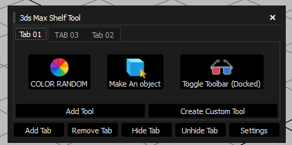

# 3ds Max Shelf Tool Pro (Open Beta) 🚀

Custom shelf tool for Autodesk 3ds Max 2025+

Developed by: **Iman Shirani**

[](https://www.paypal.com/donate/?hosted_button_id=LAMNRY6DDWDC4)


---



## ✨ Features

- 🛠️ Create custom buttons and shelves
- ⚡ Run 3ds Max Commands or Scripts instantly
- 💾 Save and Load shelf layouts
- 🖱️ Plan for future Drag and Drop reordering
- ❤️ Donation support for future development

---

## 📥 Installation

1. Copy `shelf_tool_pro.py` and `max_actions.json` into your 3ds Max `Scripts/` folder.
2. Launch it from MaxScript Editor or Scripts Menu inside 3ds Max.

> **Note:** Requires **3ds Max 2025** or newer (Python 3.11 + Qt6 / PySide6).

---

## 📜 License

This project is licensed under the **MIT License**.

You are free to:
📦 Use — for commercial and non-commercial purposes
🛠️ Modify — change the code as you wish
🚀 Distribute — share it with others

Just remember to include the original copyright notice.

---

```
MIT License

Copyright (c) 2025 Iman Shirani

Permission is hereby granted, free of charge, to any person obtaining a copy
of this software and associated documentation files (the "Software"), to deal
in the Software without restriction, including without limitation the rights
to use, copy, modify, merge, publish, distribute, sublicense, and/or sell
copies of the Software, and to permit persons to whom the Software is
furnished to do so, subject to the following conditions:

The above copyright notice and this permission notice shall be included in all
copies or substantial portions of the Software.

THE SOFTWARE IS PROVIDED "AS IS", WITHOUT WARRANTY OF ANY KIND, EXPRESS OR
IMPLIED, INCLUDING BUT NOT LIMITED TO THE WARRANTIES OF MERCHANTABILITY,
FITNESS FOR A PARTICULAR PURPOSE AND NONINFRINGEMENT. IN NO EVENT SHALL THE
AUTHORS OR COPYRIGHT HOLDERS BE LIABLE FOR ANY CLAIM, DAMAGES OR OTHER
LIABILITY, WHETHER IN AN ACTION OF CONTRACT, TORT OR OTHERWISE, ARISING FROM,
OUT OF OR IN CONNECTION WITH THE SOFTWARE OR THE USE OR OTHER DEALINGS IN THE
SOFTWARE.
```

---

## ☕ Support Development

If you enjoy this tool and want to support future updates:

[](https://www.paypal.com/donate/?hosted_button_id=LAMNRY6DDWDC4)

Thanks for your support! 🙏✨

---

## 🔥 Coming Soon

- Drag & Drop button reordering
- Syntax Highlighting inside Script Editor
- Shelf Template system
- More advanced customization options

